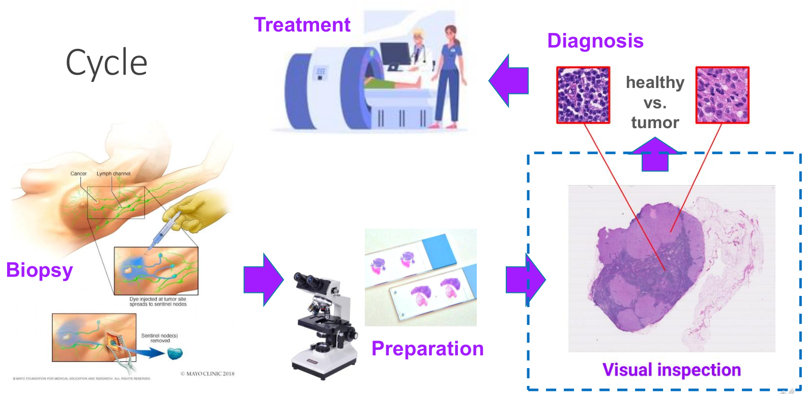
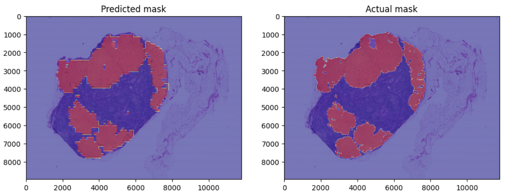

# Detecting Cancer Metastases on Gigapixel Pathology Images

This project was inspired by the [CAMELYON16 Grand Challenge](https://camelyon17.grand-challenge.org), which focuses on medical imaging and dedicates to explore more accurate and efficient deep learning algorithms to detect cancarous cells from gigapixel biopsy images. Data used in this project consists of slides and tumor masks from the [CAMELYON16](https://camelyon17.grand-challenge.org/Data/) dataset. 

Utilizing transfer learning of VGG19 and InceptionV3 architectures from Tensorflow, I found two final well-performing single-scale models, which reached accuracy of 94.3% and 93.1%, respectively. The precision were 99.3% and 99.4%, and the AUCs were 95% and 99%, respectively.

Here is a sample comparison of the predicted and the actual mask of cancerous tissues. More details can be found in the Jupyter notebook or the pdf.

